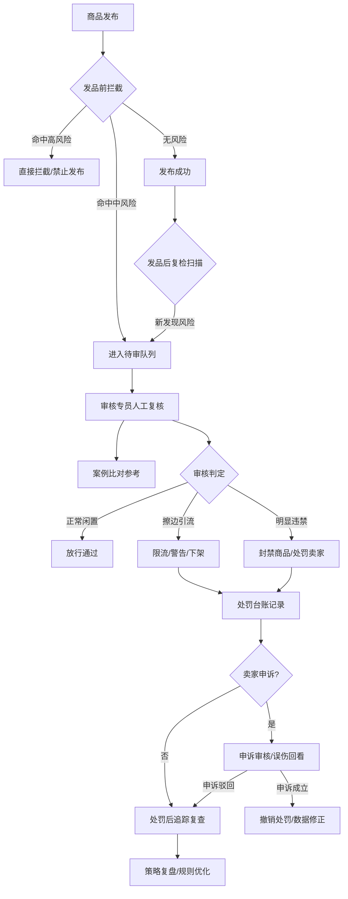

## 1. 产品概述
面向二手交易平台风控运营团队的Web审核中台，专门识别商品发布中的擦边违禁内容，围绕"发品前拦截、发品后复检、人工复核提效"三大核心场景展开。
- 主要解决：二手商品审核中擦边内容难以识别、审核效率低、口径不一致、漏判误判率高等问题
- 目标用户：平台内容安全运营人员、商品审核专员、风险策略分析师

## 2. 核心功能

### 2.1 用户角色

| 角色 | 注册方式 | 核心权限 |
|------|----------|----------|
| 审核专员 | 内部账号分配 | 待审队列处理、案例比对、审核操作 |
| 策略分析师 | 内部账号分配 | 规则配置、策略复盘、数据看板 |
| 运营主管 | 内部账号分配 | 处罚审批、团队管理、口径公告发布 |
| 系统管理员 | 超级管理员 | 账号权限、系统配置 |

### 2.2 功能模块
1. **规则总览**：风险词库管理、规则配置看板、命中趋势统计、类目风险分布
2. **待审队列**：商品列表筛选、风险详情展示、多维度风险标记、快捷审核操作
3. **案例比对**：相似违规商品聚类、历史案例检索、审核意见参考、标准案例库
4. **处罚台账**：处罚记录查询、分级处置统计、误伤申诉回看、处罚追踪复查
5. **策略复盘**：审核数据报表、漏判分析、策略效果评估、重点时段巡检、团队口径公告

### 2.3 页面详情

| 页面名称 | 模块名称 | 功能描述 |
|----------|----------|----------|
| 规则总览 | 数据看板 | 风险词命中趋势图、类目风险分布图、规则命中Top排行 |
| 规则总览 | 风险词库 | 关键词列表、增删改查、分类标签、命中次数统计 |
| 规则总览 | 规则配置 | 规则开关、权重调整、阈值设置、生效类目选择 |
| 待审队列 | 筛选导航 | 风险等级、风险类型、类目、时间、卖家信用筛选 |
| 待审队列 | 商品列表 | 商品缩略图、标题摘要、风险标签、价格、发布时间、卖家信息 |
| 待审队列 | 审核详情 | 完整商品信息、风险词高亮、图片敏感区域标注、类目匹配度分析、价格异常检测、卖家历史违规 |
| 待审队列 | 审核操作 | 通过/打回/封禁快捷操作、审核意见模板选择、处置等级建议 |
| 案例比对 | 相似商品 | 相似度排名、对比视图、风险维度并列展示 |
| 案例比对 | 标准案例库 | 典型违规案例、判定依据、历史审核结果参考 |
| 处罚台账 | 处罚列表 | 处罚记录查询、状态筛选、操作人追踪 |
| 处罚台账 | 申诉管理 | 申诉列表、申诉审核、误伤标记、数据回滚 |
| 策略复盘 | 数据报表 | 审核量、通过率、处罚率趋势、团队工作量统计 |
| 策略复盘 | 巡检中心 | 重点时段批量巡检、定时任务配置、异常预警 |
| 策略复盘 | 口径公告 | 审核口径发布、重要通知、案例分享 |

## 3. 核心流程
用户登录系统后，根据角色进入不同工作台。审核专员主要在待审队列中按风险优先级处理商品，可随时调用案例比对参考历史判定；策略分析师通过规则总览配置和调整风控策略，通过策略复盘评估策略效果并优化。

## 4. 用户界面设计

### 4.1 设计风格
- **主色调**：深蓝灰 #1E293B（专业稳重）+ 警示橙 #F59E0B（中等风险）+ 危险红 #EF4444（高风险）+ 安全绿 #10B981（正常）
- **辅助色**：信息蓝 #3B82F6、浅灰紫 #8B5CF6
- **按钮风格**：圆角4px，实心按钮为主，重要操作带图标+文字
- **字体**：中文使用"PingFang SC"，数字和英文使用"SF Mono"，层级清晰
- **布局风格**：左导航 + 顶部工具栏 + 内容区三栏布局，卡片式信息组织
- **图标风格**：线性图标为主，关键状态点配实色badge，保持简洁专业
- **整体氛围**：专业风控仪表盘风格，深色侧边栏+浅色内容区，高对比度数据展示

### 4.2 页面设计概述

| 页面名称 | 模块名称 | UI元素 |
|----------|----------|--------|
| 规则总览 | 数据看板 | 统计卡片、折线图、饼图、柱状图、热力图 |
| 规则总览 | 风险词库 | 表格、标签组、搜索框、批量操作工具栏 |
| 待审队列 | 商品列表 | 数据表格、风险标签徽章、进度条、优先级标识 |
| 待审队列 | 审核详情 | 左右分栏（左商品详情/右风险分析）、高亮文本、图片标注框、折叠面板 |
| 案例比对 | 对比视图 | 左右/多栏对比布局、同步滚动、差异高亮 |
| 处罚台账 | 列表+详情 | 时间线、状态徽章、操作日志列表、申诉表单 |
| 策略复盘 | 数据报表 | 多维度图表、团队绩效排名、漏斗图 |
| 全局 | 导航系统 | 左侧图标+文字菜单、顶部面包屑+通知+用户头像 |

### 4.3 响应式
- 桌面优先设计，以1440px宽度为基准
- 侧边栏支持折叠为图标模式
- 表格列支持自适应，移动端转为卡片列表
- 图表区域支持响应式缩放

### 4.4 动效设计
- 页面切换：淡入+轻微上移过渡（150ms）
- 风险标签：脉冲呼吸动画（高风险项）
- 审核操作成功：Toast提示+轻微缩放反馈
- 数据加载：骨架屏+进度条
- 悬停反馈：卡片微上浮、按钮色阶加深
