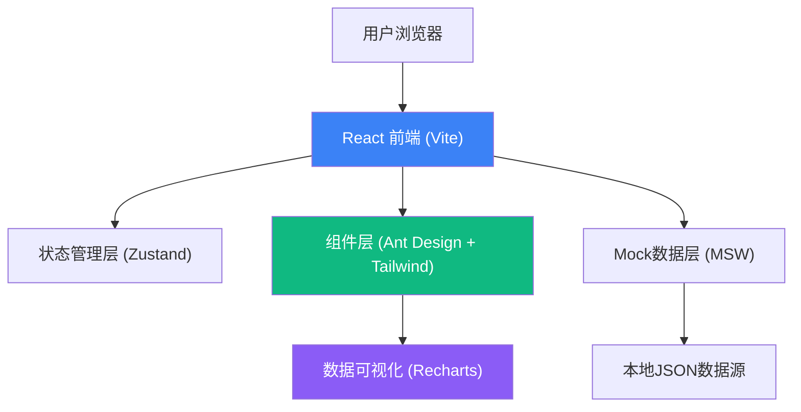

## 1. 架构设计



## 2. 技术描述
- **前端框架**: React@18 + TypeScript
- **构建工具**: Vite@5
- **样式方案**: TailwindCSS@3 + CSS Variables（主题系统）
- **UI组件库**: Ant Design@5（定制化主题）
- **图表库**: Recharts@2
- **状态管理**: Zustand（轻量级状态管理）
- **路由管理**: React Router Dom@6
- **图标库**: Lucide React
- **日期处理**: Day.js
- **Mock方案**: 本地Mock数据 + TypeScript类型定义
- **代码规范**: ESLint + Prettier

## 3. 路由定义

| 路由路径 | 页面名称 | 主要功能 |
|----------|----------|----------|
| / | 首页重定向 | 重定向至规则总览或待审队列 |
| /dashboard | 规则总览 | 数据看板、风险词库、规则配置 |
| /queue | 待审队列 | 商品列表、审核详情、审核操作 |
| /queue/:id | 审核详情页 | 单个商品完整审核界面 |
| /compare | 案例比对 | 相似商品对比、标准案例库 |
| /punishment | 处罚台账 | 处罚记录、申诉管理 |
| /review | 策略复盘 | 数据报表、巡检中心、口径公告 |
| /review/inspection | 巡检中心 | 批量巡检、定时任务 |
| /review/announcements | 口径公告 | 公告列表、发布管理 |

## 4. 数据模型定义

### 4.1 TypeScript 核心类型

```typescript
// 风险等级
type RiskLevel = 'high' | 'medium' | 'low' | 'safe';

// 风险类型
type RiskType = 'keyword' | 'image' | 'category_mismatch' | 'price_abnormal' | 'evasion' | 'history' | 'similar';

// 商品状态
type ProductStatus = 'pending' | 'approved' | 'rejected' | 'banned' | 'appealed';

// 处置等级
type PunishmentLevel = 'warning' | 'delist' | 'restrict' | 'ban_product' | 'ban_seller';

// 用户角色
type UserRole = 'reviewer' | 'analyst' | 'supervisor' | 'admin';

// 商品信息
interface Product {
  id: string;
  title: string;
  description: string;
  category: string;
  categoryId: string;
  price: number;
  originalPrice?: number;
  images: ProductImage[];
  seller: Seller;
  publishTime: string;
  riskLevel: RiskLevel;
  riskScore: number;
  riskTags: RiskTag[];
  status: ProductStatus;
  reviewCount: number;
}

// 商品图片
interface ProductImage {
  id: string;
  url: string;
  sensitiveAreas: SensitiveArea[];
}

// 敏感区域
interface SensitiveArea {
  id: string;
  x: number;
  y: number;
  width: number;
  height: number;
  type: string;
  confidence: number;
}

// 卖家信息
interface Seller {
  id: string;
  name: string;
  avatar: string;
  creditLevel: number;
  violationCount: number;
  joinDate: string;
  phone: string;
}

// 风险标签
interface RiskTag {
  id: string;
  type: RiskType;
  level: RiskLevel;
  description: string;
  evidence?: string;
  suggestion?: string;
}

// 风险词
interface RiskKeyword {
  id: string;
  word: string;
  category: string;
  level: RiskLevel;
  weight: number;
  hitCount: number;
  enabled: boolean;
  createTime: string;
  effectiveCategories: string[];
}

// 审核记录
interface ReviewRecord {
  id: string;
  productId: string;
  productTitle: string;
  reviewerId: string;
  reviewerName: string;
  action: PunishmentLevel;
  opinion: string;
  templateId?: string;
  createTime: string;
}

// 处罚记录
interface Punishment {
  id: string;
  productId: string;
  productTitle: string;
  sellerId: string;
  sellerName: string;
  level: PunishmentLevel;
  reason: string;
  operatorId: string;
  operatorName: string;
  createTime: string;
  status: 'active' | 'appealed' | 'revoked' | 'expired';
  appealDeadline?: string;
}

// 申诉记录
interface Appeal {
  id: string;
  punishmentId: string;
  sellerName: string;
  reason: string;
  evidence: string[];
  status: 'pending' | 'approved' | 'rejected';
  submitTime: string;
  handlerId?: string;
  handlerName?: string;
  handleTime?: string;
  handleOpinion?: string;
}

// 审核意见模板
interface ReviewTemplate {
  id: string;
  name: string;
  content: string;
  level: PunishmentLevel;
  category: string;
  useCount: number;
}

// 口径公告
interface Announcement {
  id: string;
  title: string;
  content: string;
  type: 'policy' | 'case' | 'notice';
  priority: 'normal' | 'important' | 'urgent';
  authorId: string;
  authorName: string;
  publishTime: string;
  readCount: number;
}

// 统计数据
interface DashboardStats {
  totalPending: number;
  totalReviewedToday: number;
  approvalRate: number;
  highRiskCount: number;
  averageReviewTime: number;
  violationTrend: TrendItem[];
  categoryRisk: CategoryRiskItem[];
  topKeywords: KeywordHitItem[];
  teamPerformance: TeamPerformanceItem[];
}

interface TrendItem {
  date: string;
  count: number;
  high: number;
  medium: number;
  low: number;
}

interface CategoryRiskItem {
  category: string;
  count: number;
  percentage: number;
}

interface KeywordHitItem {
  keyword: string;
  count: number;
  trend: number;
}

interface TeamPerformanceItem {
  userId: string;
  userName: string;
  reviewed: number;
  accuracy: number;
  avgTime: number;
}
```

### 4.2 模块划分

```
src/
├── assets/          # 静态资源
├── components/      # 公共组件
│   ├── Layout/      # 布局组件
│   ├── RiskTag/     # 风险标签组件
│   ├── RiskBadge/   # 风险徽章
│   ├── DataCard/    # 数据卡片
│   ├── ImageMarker/ # 图片标注组件
│   ├── HighlightText/ # 高亮文本
│   └── StatusTag/   # 状态标签
├── pages/           # 页面组件
│   ├── Dashboard/   # 规则总览
│   ├── Queue/       # 待审队列
│   ├── Compare/     # 案例比对
│   ├── Punishment/  # 处罚台账
│   └── Review/      # 策略复盘
├── stores/          # Zustand状态管理
├── router/          # 路由配置
├── types/           # TypeScript类型定义
├── mock/            # Mock数据
├── utils/           # 工具函数
├── hooks/           # 自定义Hooks
├── styles/          # 全局样式
└── constants/       # 常量配置
```

### 4.3 状态管理结构

```typescript
// 审核状态Store
interface ReviewStore {
  // 待审队列
  pendingProducts: Product[];
  currentProduct: Product | null;
  selectedIds: string[];
  
  // 筛选条件
  filters: {
    riskLevel?: RiskLevel;
    riskType?: RiskType;
    category?: string;
    timeRange?: [string, string];
    sellerCredit?: number;
    keyword?: string;
  };
  
  // 分页
  pagination: { current: number; pageSize: number; total: number };
  
  // 动作
  setFilters: (f: Partial<ReviewStore['filters']>) => void;
  setCurrentProduct: (p: Product | null) => void;
  approveProduct: (id: string, opinion: string) => Promise<void>;
  rejectProduct: (id: string, level: PunishmentLevel, opinion: string) => Promise<void>;
  batchApprove: (ids: string[]) => Promise<void>;
}
```

## 5. 组件设计原则

1. **单一职责**: 每个组件只负责一个功能，保持组件粒度适中
2. **类型安全**: 所有组件Props和数据都使用完整的TypeScript类型定义
3. **可组合性**: 基础组件可以灵活组合成复杂组件
4. **响应式**: 重要组件支持响应式布局
5. **可访问性**: 关键操作支持键盘导航，状态变化有明确反馈

## 6. 性能优化策略

1. **懒加载**: 路由级别代码分割，按需加载页面组件
2. **虚拟列表**: 长列表（商品列表、处罚记录等）使用虚拟滚动
3. **Memo优化**: 复杂图表和表格组件使用React.memo
4. **状态隔离**: 使用Zustand选择性订阅避免不必要重渲染
5. **防抖节流**: 搜索输入、滚动事件等使用防抖节流
